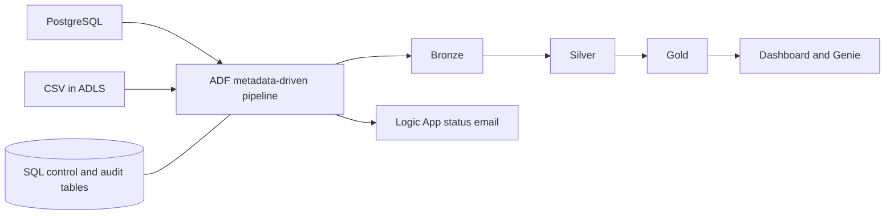
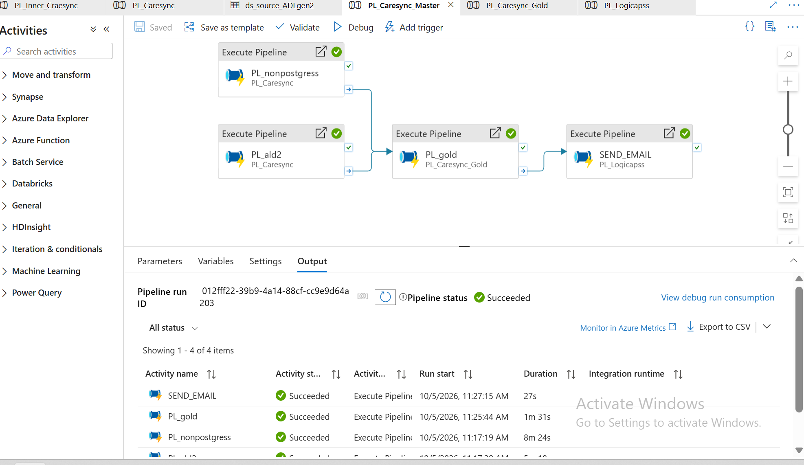
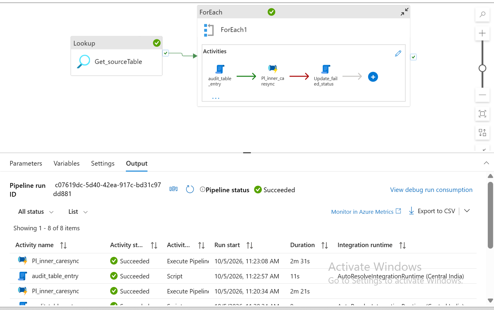
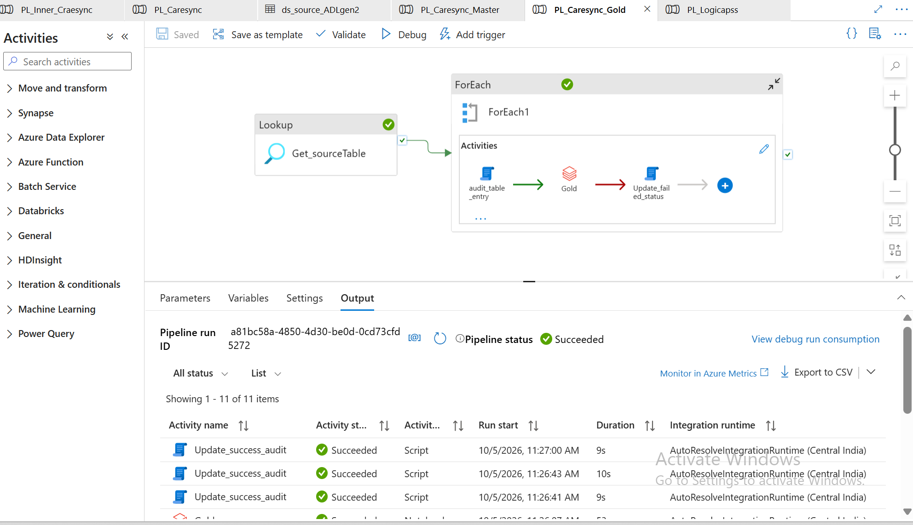
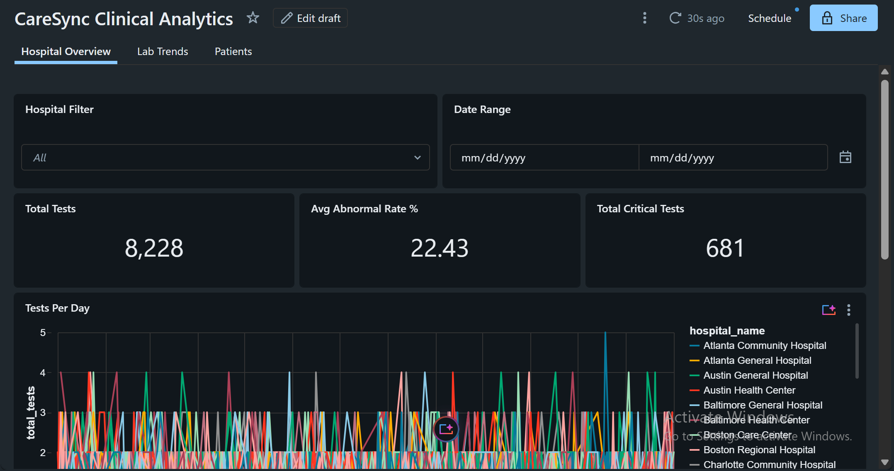
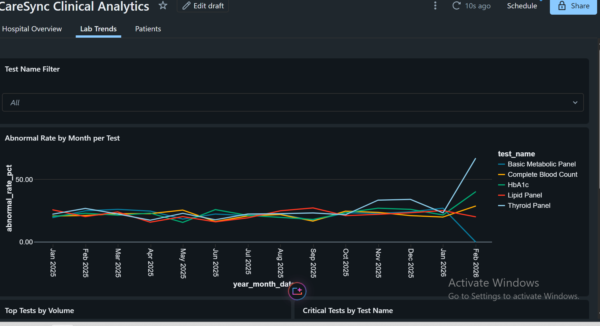
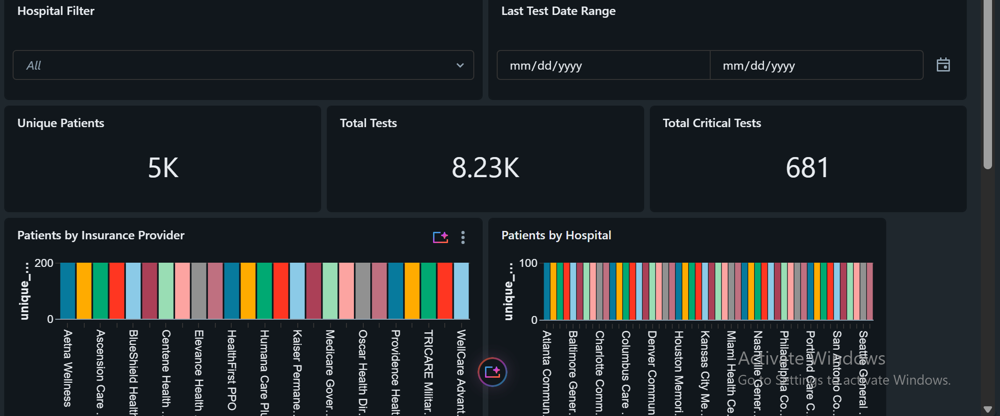

# CareSync Health Network: Metadata-Driven Data Platform on Azure

A guided project that I built and extended, based on the CareSync course by Narender Kumar (DataBeli).

## Problem
Hospitals keep patient and hospital data in internal systems and receive lab results and insurance files from partners. Combining them by hand is slow and error-prone, and adding a new source is hard.

## Solution
- One reusable Azure Data Factory pipeline, driven by a SQL control table, ingests PostgreSQL and CSV sources (full and incremental loads).
- Databricks transforms the data through Bronze, Silver and Gold layers (Delta Lake, Unity Catalog).
- Every run is logged in an audit table, and a status email is sent through Logic Apps.
- A Databricks dashboard and Genie sit on the Gold tables.

## Architecture

## Tech stack
Azure Data Factory, ADLS Gen2, Azure SQL, Key Vault, Logic Apps, Databricks, PySpark, Delta Lake, Unity Catalog, GitHub

## What I added
- Null handling for config-driven notebook parameters
- A path-exists check, so the notebook exits cleanly when no new files arrive
- Gold notebooks and dashboard

## Pipelines

## Dashboard

## Repositories
- ADF pipelines: https://github.com/Vega343/caresync-adf
- Databricks notebooks: https://github.com/Vega343/caresync-databricks

## Credit
Original project and course by Narender Kumar: https://github.com/databeli/caresync_azure_project
